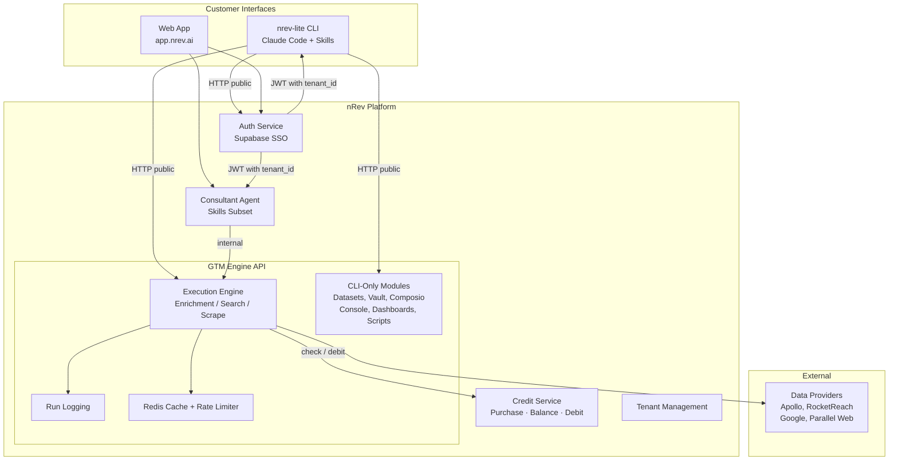

# nRev GTM Engine — System Architecture & Integration Plan

## Overview

The nRev platform is the single product. It has two customer interfaces — the **Web App** (app.nrev.ai) and the **nrev-lite CLI** (Claude Code integration). Both interfaces talk to backend services within the platform, including the **GTM Engine API** which handles all data enrichment, search, and scraping operations.

The GTM Engine is a backend service *inside* the platform, not an external system. Some of its modules serve both interfaces (execution engine), while others are CLI-specific (datasets, vault, Composio, dashboards).

This document captures the high-level component layout, ownership boundaries, and migration trajectory.

---

## System Components

```
┌───────────────────────────────────────────────────────────────────────┐
│                        CUSTOMER INTERFACES                            │
│                                                                       │
│  ┌─────────────────────────┐        ┌──────────────────────────────┐ │
│  │  nrev-lite CLI           │        │  Web App (app.nrev.ai)       │ │
│  │                          │        │                               │ │
│  │  Claude Code + Skills    │        │  Platform UI                  │ │
│  │  MCP Tools (29 tools)    │        │  Consultant Agent (Skills)    │ │
│  │  Click CLI Commands      │        │                               │ │
│  └────────────┬─────────────┘        └──────────────┬────────────────┘ │
│               │                                      │                 │
└───────────────┼──────────────────────────────────────┼─────────────────┘
                │ HTTP (public)                        │ HTTP (internal)
                │                                      │
┌───────────────┼──────────────────────────────────────┼─────────────────┐
│               │          nREV PLATFORM               │                 │
│               ▼                                      ▼                 │
│  ┌─────────────────────────────────────────────────────────────────┐   │
│  │                    Auth Service (Supabase SSO)                   │   │
│  │              Tenant Management  ·  User Management               │   │
│  │                  Issues JWT with tenant_id for RLS               │   │
│  └─────────────────────────────────────────────────────────────────┘   │
│                                                                        │
│  ┌─────────────────────────────────────────────────────────────────┐   │
│  │                  Credit Service (Single Window)                  │   │
│  │          Purchase · Balance · Check · Debit · History            │   │
│  │              Source of truth for all credit operations            │   │
│  └──────────────────────────────┬──────────────────────────────────┘   │
│                                 │ check / debit                        │
│                                 ▼                                      │
│  ┌─────────────────────────────────────────────────────────────────┐   │
│  │                    GTM ENGINE API (this repo)                    │   │
│  │                    FastAPI — server/                              │   │
│  │                                                                  │   │
│  │  ┌──────────────────────┐    ┌────────────────────────────────┐  │   │
│  │  │  Shared               │    │  CLI-Only                      │  │   │
│  │  │  (CLI + Consultant)   │    │                                │  │   │
│  │  │                       │    │  Console / Dashboards          │  │   │
│  │  │  Execution Engine     │    │  Datasets API                  │  │   │
│  │  │  (providers,          │    │  Tables API                    │  │   │
│  │  │   enrichment,         │    │  Vault (BYOK)                  │  │   │
│  │  │   search, scraping)   │    │  Composio (MCP)                │  │   │
│  │  │                       │    │  Scripts                       │  │   │
│  │  │  Run Logging          │    │  Hosted Apps                   │  │   │
│  │  │  Search Patterns      │    │  Schedules                     │  │   │
│  │  │  Cost Estimation      │    │  Learning System               │  │   │
│  │  └──────────────────────┘    └────────────────────────────────┘  │   │
│  │                                                                  │   │
│  │  PostgreSQL (RLS per tenant)  ·  Redis (cache + rate limits)     │   │
│  └─────────────────────────────────┬───────────────────────────────┘   │
│                                    │                                   │
│  ┌─────────────────────────────────┐                                   │
│  │  Consultant Agent               │                                   │
│  │  (Skills subset → calls         │                                   │
│  │   Execution Engine internally)  │                                   │
│  └─────────────────────────────────┘                                   │
│                                                                        │
└────────────────────────────────────┬───────────────────────────────────┘
                                     │
                                     ▼
                      ┌──────────────────────────────┐
                      │  External Data Providers      │
                      │  Apollo · RocketReach          │
                      │  Google · Parallel Web         │
                      └──────────────────────────────┘
```

---

## Component Roles

### 1. Customer Interfaces (External)

| Interface | Detail |
|-----------|--------|
| **nrev-lite CLI** | Python package used inside Claude Code. Full feature set — enrichment, search, datasets, BYOK, Composio, dashboards. Talks to GTM Engine over public HTTPS. Will eventually become its own repo. |
| **Web App** | Platform UI at app.nrev.ai. Hosts the consultant agent. Users interact with enrichment through the agent, not directly with GTM Engine APIs. |

### 2. Platform Services

| Service | Detail |
|---------|--------|
| **Auth Service** | Supabase SSO. Single identity provider for both CLI and web app users. Issues JWT containing `tenant_id` used for RLS scoping in GTM Engine. |
| **Credit Service** | Single window for purchasing and consuming credits. Owns balance, purchase, debit, and history. GTM Engine calls this service to check availability before an operation and to debit after completion. |
| **Tenant Management** | User-to-tenant mapping, org management. Shared across all interfaces. |
| **Consultant Agent** | AI agent inside the web app. Gets a subset of CLI skills (execution-focused). Calls GTM Engine execution APIs internally to perform enrichment on behalf of users. |

### 3. GTM Engine API (this repo — server/)

| Aspect | Detail |
|--------|--------|
| **What it is** | FastAPI backend service *within* the platform |
| **Core job** | Provider proxy, execution pipeline, caching, rate limiting, run logging |
| **Credit flow** | Calls platform credit service to check balance before ops, reports consumption after |
| **Infra** | PostgreSQL (Aurora) with RLS, Redis (ElastiCache), deployed on ECS Fargate |
| **Shared modules** | Execution engine, run logging, search patterns, cost estimation — used by both CLI and consultant agent |
| **CLI-only modules** | Datasets, tables, vault, Composio, console, dashboards, scripts, schedules, hosted apps, learning system |

---

## Interaction Map



---

## Credit Flow

Credits are fully owned by the platform credit service. GTM Engine is a *consumer*, not a manager.

```
User buys credits ──► Credit Service (platform) ──► stores balance

CLI or Consultant triggers operation
    │
    ▼
GTM Engine Execution
    │
    ├── 1. Call Credit Service: "Can tenant X afford 1 credit?"
    │       └── Credit Service returns: yes/no
    │
    ├── 2. Execute operation (call external provider)
    │
    └── 3. Call Credit Service: "Debit 1 credit from tenant X"
            └── Credit Service records transaction
```

- BYOK calls are free — no credit check needed when tenant uses their own API keys
- Cost estimation (`/api/v1/execute/cost`) checks credit service for current balance
- Single purchase flow in web app; CLI users buy credits through the same platform UI

---

## Migration Trajectory

No premature microservice splits. Changes happen as integration demands them.

### Phase 1: Auth Unification (In Progress)
- CLI login redirects to `app.nrev.ai/cli/auth` (Supabase SSO)
- Platform exchanges Supabase JWT for gtm-engine JWT (contains `tenant_id` for RLS)
- Console Google SSO stays as-is temporarily (CLI users keep separate login for now)
- gtm-engine stops owning identity — JWT is for data scoping, not authentication

### Phase 2: Credit Migration
- Platform credit service becomes the single source of truth
- gtm-engine billing module deprecated — replaced by calls to platform credit service
- GTM Engine calls credit service to check + debit per operation
- Single purchase and balance window in the web app for all users

### Phase 3: Consultant Agent Launch
- Consultant agent gets execution-focused skill subset (no BYOK, no Composio, no data module)
- Calls GTM Engine execution APIs internally (same VPC, no public internet)
- API endpoint whitelist enforced at orchestrator level (V1), JWT claims (V2)
- Shared cache and rate limits across CLI and consultant for same tenant

### Phase 4: Gradual Module Isolation (Future)
- Execution engine extracted as independent service if scale demands it
- CLI-only modules (vault, Composio, datasets) stay in gtm-engine
- Auth and credit modules fully removed from gtm-engine once platform owns them
- CLI package separated into its own repo when stable

---

## Endpoint Access Matrix

| Endpoint Group | CLI | Consultant Agent |
|----------------|-----|------------------|
| `/api/v1/execute/*` (enrichment, search, scrape) | Yes | Yes |
| `/api/v1/execute/cost` (cost estimation) | Yes | Yes |
| `/api/v1/search/patterns` | Yes | Yes |
| `/api/v1/auth/exchange` | Yes | Yes |
| `/api/v1/tables/*`, `/api/v1/datasets/*` | Yes | No |
| `/api/v1/connections/*` (Composio) | Yes | No |
| `/api/v1/keys/*` (BYOK vault) | Yes | No |
| `/api/v1/dashboards/*` | Yes | No |
| `/api/v1/scripts/*` | Yes | No |
| `/api/v1/schedules/*` | Yes | No |
| `/api/v1/apps/*` (hosted apps) | Yes | No |

---

## Key Design Decisions

1. **GTM Engine is a platform service, not a separate system** — it sits alongside auth, credits, and tenant management within the nRev platform.
2. **No premature microservice split** — the monolith works. Modules get migrated or isolated only when integration requires it.
3. **One execution engine, two clients** — CLI and consultant agent share the same provider pipeline, response cache, and rate limits. Cache is tenant-scoped and content-addressed — identical operations from either interface hit the same cache entry (free, no credit charged). Run logging lives in gtm-engine for now but will eventually move to the platform.
4. **Platform owns credits entirely** — single purchase window, single balance. GTM Engine calls the credit service to check and debit, never manages credits itself.
5. **Platform owns identity** — Supabase SSO for both interfaces. GTM Engine JWT is for RLS scoping, not authentication.
6. **Skills are the intelligence layer** — they decide *what* to do. The server handles *how*. Both CLI and consultant agent consume skills, but consultant gets a restricted subset.
7. **Shared cache across interfaces** — Redis response cache is tenant-scoped and content-addressed (`cache:exec:{tenant_id}:{operation}:{params_hash}`). Identical operations from CLI or consultant agent hit the same cache entry. Cache hits are free (no credit charged). This works out of the box with no additional config.
8. **BYOK decision pending** — whether consultant agent can use tenant's own API keys (free calls) or is forced to platform keys (credit-based) is an open design choice.
